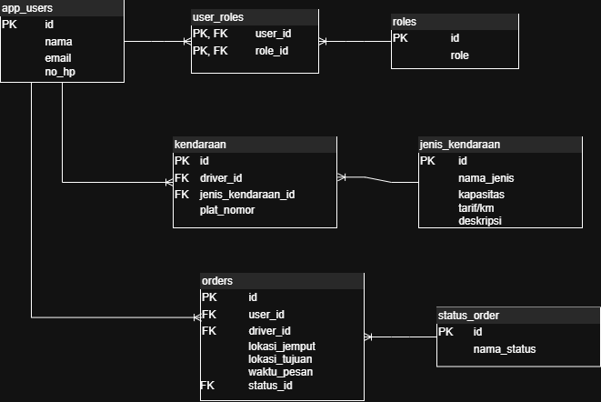
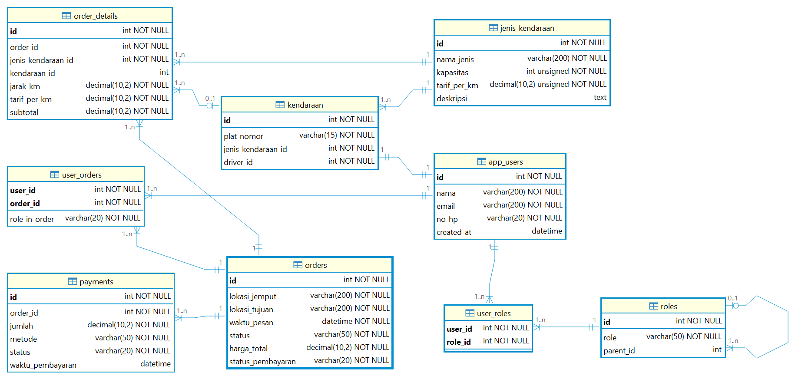

# Taksol Database (taksol_db)

## Deskripsi
`taksol_db` adalah database untuk sistem pemesanan transportasi (ride-hailing).
Database ini mengelola data user, role, kendaraan, jenis kendaraan, pesanan (orders),
dan status pesanan dengan struktur relasi yang telah dinormalisasi.

Database dirancang menggunakan **MySQL** dan siap digunakan untuk pengembangan
aplikasi backend (REST API, mobile app, dan layanan terdistribusi lainnya).

---

## Teknologi
- Database: MySQL
- Tools: DBeaver, draw.io, Git, GitHub

---

## Struktur Database

### Diagram Awal (Perancangan)
Diagram berikut merupakan rancangan awal struktur database yang dibuat menggunakan **draw.io**
sebagai acuan sebelum implementasi ke dalam MySQL.

---

### Penjelasan Tabel

#### 1. Tabel `app_users`
Menyimpan data pengguna aplikasi, baik sebagai pemesan, driver, maupun admin.

#### 2. Tabel `roles`
Menyimpan jenis peran (role) yang dimiliki oleh user, seperti Admin, Driver, dan Customer.

#### 3. Tabel `user_roles`
Tabel penghubung untuk relasi **many-to-many** antara `app_users` dan `roles`.

#### 4. Tabel `jenis_kendaraan`
Menyimpan jenis kendaraan beserta informasi tarif dan kapasitas.

#### 5. Tabel `kendaraan`
Menyimpan data kendaraan yang digunakan oleh driver dan terhubung ke jenis kendaraan tertentu.

#### 6. Tabel `status_order`
Menyimpan status dari pesanan, seperti pending, diproses, selesai, atau dibatalkan.

#### 7. Tabel `orders`
Menyimpan data pemesanan transportasi, termasuk pemesan, driver (opsional), lokasi, dan status pesanan.

---

## Relasi Antar Tabel

- **app_users ↔ roles**  
  Relasi many-to-many melalui tabel `user_roles`.

- **jenis_kendaraan → kendaraan**  
  Relasi one-to-many (satu jenis kendaraan dapat digunakan oleh banyak kendaraan).

- **app_users → kendaraan**  
  Relasi one-to-many (satu driver dapat memiliki kendaraan).

- **status_order → orders**  
  Relasi one-to-many.

- **app_users → orders**
  - `pemesan_id` → NOT NULL (order wajib memiliki pemesan)
  - `driver_id` → NULLABLE (driver dapat ditentukan setelah order dibuat)

---

## Query Database
Seluruh query pembuatan tabel dan relasi dapat diakses pada file berikut:

 **SQL Schema**  
[sql/taksol_db.sql](sql/taksol_db.sql)

---

## Entity Relationship Diagram (ERD)
Diagram ERD berikut dihasilkan menggunakan fitur  
**View Diagram (Reverse Engineering)** di DBeaver berdasarkan database yang telah diimplementasikan.

---

## Author
Nama: Yohanes Fransiskus Making  
Program: Dimata Bootcamp
